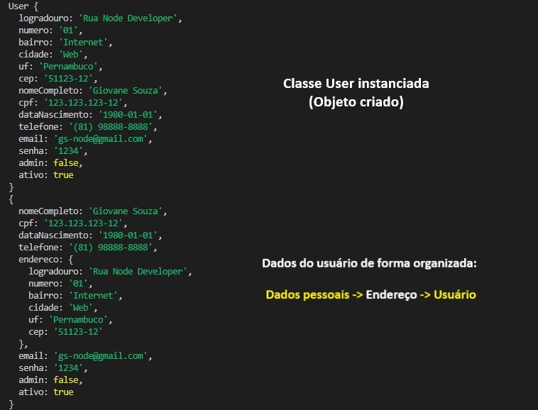

# Criação de objeto para representar um Usuário

## Sobre o projeto

O objetivo deste projeto é criar um objeto para representar um usuário. 
Para tanto, foram criados **quatro arquivos**, sendo **três** para **representar as classes** (`Address.js`, `Person.js` e `User.js`) e um `index.js` que fica responsável pela execução do programa.

### Descrição dos arquivos

1. `Address.js`: Utilizada para informações cadastrais referentes ao endereço - **logradouro, número, bairro, cidade, uf e cep**.

1. `Person.js`: Esta classe herda os atributos da classe `Address.js`, permitindo criar um objeto com dados de uma pessoa - **nomeCompleto, cpf, dataNascimento e telefone** - + os dados do endereço.

1. `User.js`: Herda tudo de `Person.js` e contém seus atributos específicos - **email, senha, admin?, perfil está ativo?**.

1. `index.js`: Neste arquivo acontece o instanciamento do usuário + modificação na organização dos dados do objeto.

> Para fins de organização, cada classe foi criada em um arquivo isolado, sendo exportada e utilizada no local necessário para o funcionamento do programa.

## Resultado obtido

