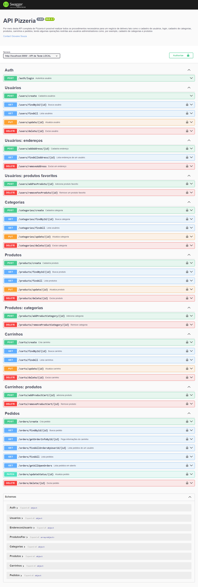

# Pizzeria com NodeJS (API)


## Sobre o projeto
Consiste em uma **API** desenvolvida com **NodeJS** para Pizzaria, seguindo o padrão de **arquitetura MVC**, **conexão com banco de dados MongoDB via mongoose**, **criptografia com bcrypt** **token JWT** e **documentação Swagger**.

> Este projeto foi desenvolvido como parte avaliativa do módulo de **Back-End Development** do curso **Desenvolvimento Full Stack** da empresa **Ília** em parceria com a **Italents**.


## Pré-requesitos para testar a API localmente.

>[!IMPORTANT]
> 
> * [x] Ter o git instalado na máquina;
> * [x] Ter o Node instalado;
> * [x] Ter o MongoDB instalado;
> * [x] Ter um editor de código de sua preferência;
> * [x] Clonar o repositório por meio do comando abaixo;
>    ``` shell
>   git clone https://github.com/giovanesouza/node-pizzeria.git
>    ```
> * [x] Baixe as dependências do projeto utilizando o comando: `npm i`;
> * [x] Utilize uma ferramenta que possibilite realizar todos os tipos requisições como o `Postman`, `Insomnia` ou uma extensão chamada `Thunder Client` que possibilita realizar as requisições dentro do **VS CODE**.
>
> [!TIP]
> 
> Utilizei a extensão mencionada acima para realizar as requisições. Caso você opte em utilizá-la, **deixei uma pasta chamada `Thunder Client` com todos os endpoints exportados** prontos para uso, basta importá-lo.
> 
> * [x] Execute o programa utilizando o comando: `npm start`;


## Documentação Swagger UI

> Para testar a API por meio da documentação swagger, utilize o caminho a seguir: `http://localhost:3000/docs/api-docs/`

