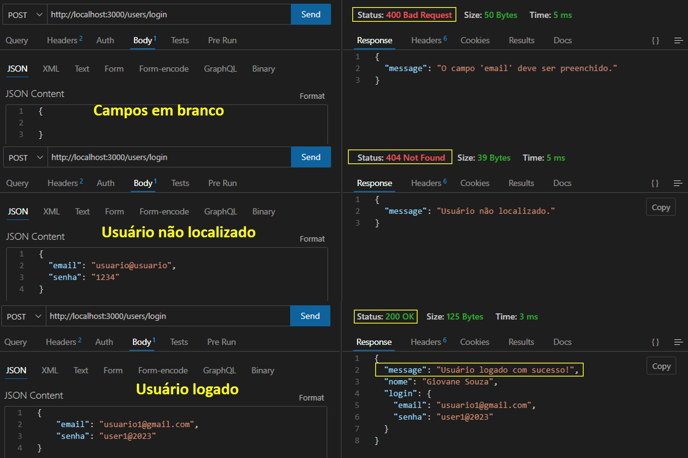
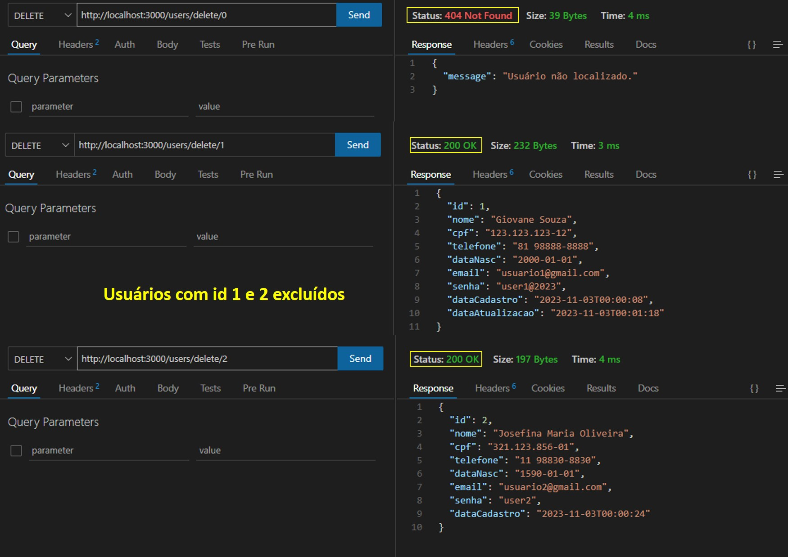

# Criação de objeto para representar um Usuário

## Como visualizar o projeto localmente?

### Pré-requesitos:

>[!IMPORTANT]
> 
> * [x] Ter o git instalado na máquina;
> * [x] Ter o Node instalado;
> * [x] Ter um editor de código de sua preferência;
> * [x] Clone o repositório por meio do comando abaixo;
``` shell
# Clone
git clone https://github.com/giovanesouza/node-pizzeria.git

# Mude para a branch abaixo
git checkout 2-mvc-user-crud

```
> * [x] Baixe as dependências do projeto utilizando o comando: `npm install`;
> * [x] Utilize uma ferramenta que possibilite realizar todos os tipos requisições como o `Postman`, `Insomnia` ou uma extensão chamada `Thunder Client` que possibilita realizar as requisições dentro do **VS CODE**.
> * [x] Execute o programa utilizando o comando: `npm start`;


## Sobre o projeto

Consiste em um CRUD para usuários, utilizando o Node/Express, com a arquitetura de projetos no padrão MVC.

> A princípio os dados serão trabalhado em memória - **sem banco de dados**.


### Rotas disponíveis

* Inicializa a aplicação - **GET**: `http://localhost:3000/` 

* Cria um usuário - **POST**: `http://localhost:3000/users/create`


```json

// Dados obrigatórios ao cadastrar usuário - inserir no corpo da requisição

    {
        "id": ,
        "nome": "",
        "cpf": "",
        "telefone": "",
        "dataNasc": "",
        "email": "",
        "senha": ""
    }

```

* Lista um usuário - **GET**: `http://localhost:3000/users/find/:id`
* Lista todos os usuário cadastrados - **GET**: `http://localhost:3000/users/findAll`
* Atualiza um registro - **PUT**: `http://localhost:3000/users/update/:id`

```json

// Dados obrigatórios ao atualizar registro - inserir no corpo da requisição

    {
        "id": ,
        "nome": "",
        "cpf": "",
        "telefone": "",
        "dataNasc": "",
        "email": "",
        "senha": ""
    }

```

* Exclui um registro - **DELETE**: `http://localhost:3000/users/delete/:id`
* Realiza login - **POST**: `http://localhost:3000/users/login`

```json

// Dados obrigatórios ao realizar login - inserir no corpo da requisição

    {
        "email": "",
        "senha": ""
    }

```


## Resultados obtidos

### Validações ao cadastrar usuário


<br/>

### Cadastro realizado com sucesso


<br/>

### Busca por um usuário


<br/>

### Listagem de todos os usuários cadastrados


<br/>

### Atualização cadastral


<br/>

### Login


<br/>

### Exclusão de cadastro

